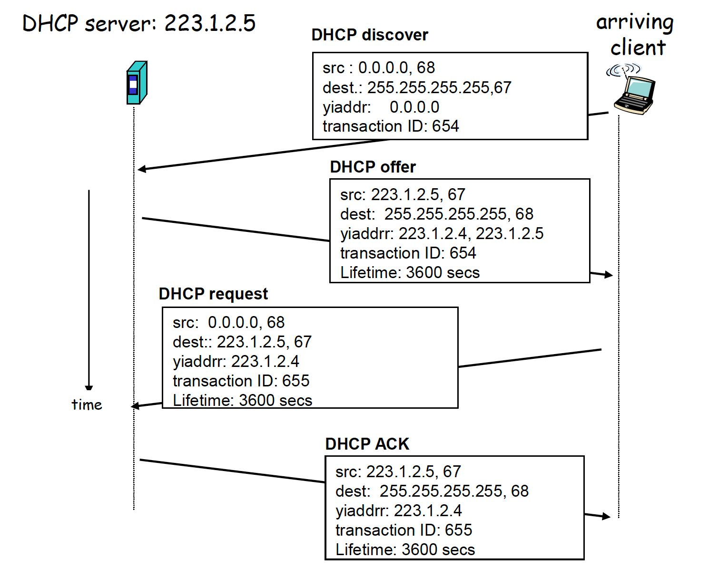

# CS339 Computer Network: A Review

授课老师：申丽萍，赵世振（英文班）

整理者：[Yanjie Ze](http://yanjieze.com)

开始日期：Jan 4, 2021

考试日期：Jan 14, 2021

# Chapter 1 Introduction

| 五层结构          | 属于       |
| ----------------- | ---------- |
| application layer | user level |
| transport layer   | OS         |
| network layer     | OS         |
| data link layer   | OS/NIC     |
| physical layer    | NIC        |

- **Local Area Networks**
  - Apart from scale, LANs distinguish themselves from other networks by (generally) using **broadcast** technology,

- **Metropolitan Area Networks**
- **Wide Area Networks**
- **Internetworks**
  - 把LAN用WAN连起来，再把WAN互相连起来

- Bandwidth (Hz):the range of frequencies transmitted without being strongly attenuated.
- The **baud rate** is the number of samples or symbols per second sent over the channel.
- The **bit rate** is the amount of information per second sent over the channel.
- **Throughput / the real data rate**: rate (bits/sec) at which bits transferred between sender/receiver

- **Nyquist's theorem**
  $$
  maximum\ data\ rate=2H\log_2V
  $$
  

- **Shannon's theorem**
  $$
  maximum\ data\ rate=H\log_2(1+S/N)
  $$

  $$
  S/N (dB)=10\log_{10}S/N
  $$

Multiplexing:

- FDM
- TDM
- CDMA

Switching:

- **Circuit switching** (connection oriented)
- **Message switching**
- **Packet switching** (packet switching)
  - **Virtual Circuit switching**
  - Datagram

# Chapter 2 Application Layer

## 2.1 Principles of network applications

- Application architecture
  - Client-server
  - P2P
  - hybrid of client-server and P2P
    - Skype: centralized server to find address of remote party, then client-client connection
- Sockets：进程与计算机网络之间的接口
- transport service一些指标
  - data loss
  - delay
  - throughput
  - security
- Internet transport services
  - TCP
    - connection-oriented: 需要先建立连接
    - reliable transport
    - flow control: 发送的消息不会overwhelm接收方（对于接收方）
    - congestion control: 控制网络不会拥堵（对于网络）

  - UDP
    - use packet-switch
    - unreliable data transfer
- Process identifier = IP address + port number

## 2.2 DNS

- DNS (Domain Name System):  map `www.sjtu.edu.cn` --> `202.120.2.119`
  - distributed, hierarchical database
  - **root name servers**
  - TLD (top-level domains)
  - Local name server: Client needs to be configured with local name server manually or via DHCP.
  - 找到DNS name的方法：**iterated query**
    - 先local DNS server，然后让local DNS server去找：root DNS server，TLD DNS server，authoritative DNS server
  - 找到DNS name的方法：**recursice query**
    - 先找local DNS server，然后local DNS sever找root DNS server，然后root DNS server找TLD DNS server，然后TLD DNS server找authoritative DNS server。

## 2.3 Web and HTTP

- WWW: client/server model with **http**
  - 首先用DNS把url转换成IP address
  - 建立tcp connection
  - 发送http request
  - 等待http response
  - fetch embedded resources
  - 清除闲置的tcp connection
- HTTP: Hyper Text Transfer Protocol
  - 使用TCP，先建立TCP连接，然后用http发送请求
  - http是stateless的：不维持状态
  - cookies：server在client那里drop一个cookie，保存着server state。然后每次client发消息，就把之前的cookie一起发给server。相当于给client配了一个id，然后server可以在数据库里记录client的情况
- HTTP Performance: Page Load Time (PLT)
  - Round Trip Time (RTT): time for a small packet to travel from client to server and back. 一个来回叫一个RTT
  - Page Load Time (PLT): 
    - one RTT to initiate TCP connection
    - one RTT for HTTP request and first few bytes of HTTP
    - file transmission time
    - **total = 2RTT + transmit time**
- Nonpersistent HTTP:
  - one object sent over one TCP connection，每次发都要新建一个新的tcp connection
  - PLT = N*RTT + transmit time
- Ways to decrease PLT
  - 同时并行发多个http请求
  - 尽量用persistent http
  - move content closer to client
  - SPDY，一种更快的web protocol
- web cache (proxy server)
  - 目标：不用server，加个cache就行
  - browser直接发request到cache，如果有救拿，没有的话cache再向server请求
  - cache acts as both client and server
- conditional GET：cache在发GET给server的时候，加个modify的date，如果date不一样，那server就返回新的data。否则就不用返回新data，回一个304 not modified。
- content delivery networks：client接收完内容后，再把内容发给其他server和cache。这样下次别人要用可以直接拿cache和server里的。

## 2.4 FTP

- Client-server model
- 有两种connection，分开的：
  - TCP control connection，是persistent的
  - TCP data connection，每个文件都要新开一个connection，是non-persistent
- FTP server maintains "state": current directory, earlier authentication

## 2.5 Electronic Mail

email是怎么做到receiver不在的时候我们的mail也能发到呢？

- 四个部分
  - user agents
  - mail servers
  - transfer protocol (SMTP) ，服务器之间发送email
  - access protocol (POP3, IMAP)，从服务器拿取email

## 2.6 P2P applications

- P2P挑战：

  - No servers on which to rely: Communication must be peer-to-peer and self-organizing, not client-server. 必须自己调度！

  - Limited capabilities: How can one peer deliver content to all other peers? 一个人要发很多人怎么办？

  - Decentralized indexing: How will peers find content,find each other? 怎么找到其他人？

  - Participation incentives: Why will peers help each other? 为什么要互相帮助？
- Distributed Hash Table (DHT)
  - Circular DHT: 每个peer只知道后继节点的ID. $ID(peer)=hash(IP, port)$
    - key look up: 平均$O(N)$的复杂度
    - key look up with shortcuts: 每个peer也维持一些shortcut，可以降到$O(logN)$
    - **DHT Finger Table：** chap2-2, P25
  - peer leave and join: 每个peer记住它后面两个节点，定时ping一下看看在不在，第一个节点走了的话，就让第二个节点把它的后面节点发过来。

- BitTorrent Protocol
  - 选一个要接收的文件，和**tracker**请求peer list，然后和peer们进行传输
  - **tit-for-tat:** 一报还一报。过程：
    1. alice给bob乐观地来点加速，alice成为bob的top 4
    2. bob回报alice，bob也成为alice的top 4
  - Trackerless BitTorrent: 用DHT来标记文件和peer

- P2P Case study: Skype
  - hierarchical overlay with **SuperNodes**
  - 问题：alice和bob都在NAT之后
  - 解决方法:
    - Alice and Bob connectwith their SNs.
    - Relay is chosen. Each peer initiates session with relay.
    - Peers can now communicate through NATs via relay.

## 2.7 Socket programming with TCP/UDP

- 基础：

  - 首先，server和client得有一个socket
  - socket是用port number和IP进行区分

- 什么是socket：a door between application process and end-endtransport protocol (UDP or TCP) 应用层和传输层的桥梁

- 需要connection的socket（TCP）：

  

- 不需要connection的socket（UDP）：

  

  

# Chapter 3 Transport Layer

transport layer在每个end-host上还是有的，但是在router上没有。

## 3.1 Transport-layer services

- TCP和UDP的比较，如下图所示。主要考虑几个点，有无connection，是否reliable，是否限制msg长度，是否有flow/congestion control

  

- Transport **Segment**: 这玩意叫segment（在运输层），到网络层就叫packet，到链接层就叫frame

  

## 3.2 Multiplexing and demultiplexing

- Ports: server的port选的比较well known，client的port选的比较ephemeral（随意？）

- Upward multiplexing和downward multiplexing，看个图就明白了 

  

- Multiplexing/demultiplexing: 先把所有socket的数据都合起来发出去，再在接收方那里解开，分到不同的socket。

  - 带connection的demux，TCP socket：带一个四元组，src IP and port, dst IP and port
  - 不带connection的demux，UDP socket: 带一个二元组，dst IP, dst port

## 3.3 Connectionless transport: UDP

UDP, User Datagram Protocol

- 此处可以回顾一下UDP socket (2.7)

- UDP是”best effort“，可能lost，error，out of order。可以在**application layer**加reliability。

- UDP segment的形式：除了data还加了4个部分。

  

- **Why “UDP has better control over what data is sent and when” ?** 因为不用建立connection吧。

- UDP checksum: 先把所有数据相加，如果溢出了把1加到最低位。然后checksum就是取反。

- Why UDP?

  - no connection establishment (which can add delay)
  - no retransmission (which can add delay)
  - simple: no connection state at sender, receiver
  - small segment header: 8 bytes
  - no flow control and congestion control: UDP can blast away as fast as desired

## 3.4 Principles of reliable data transfer

这一节只介绍单向数据传输（unidirectional）。

### 3.4.1 rdt1.0

如图。假设了底层信道是可靠的，所以no error control。假设了接受者可以完全接收，因此no flow control。

### 3.4.2 rdt2.0

假设底层信道有可能把packet中的bit弄反了（但是没有lost）

- sender的FSM加了一个状态
- 发送的时候加了checksum来detect error
- receiver通过checksum来发送ACK或NAK。

**致命缺陷：**

- ACK/NAK坏了怎么办？可能会导致retransmission（重传），进而导致duplicate

**处理duplicate：**

- 如果ACK/NAK坏了，sender重传
- sender给每个pkt加上sequence number
- 接收方丢掉duplicate的包

由此，引出rdt2.1。

### 3.4.3 rdt2.1: sender, handles garbled ACK/NAKs

Sender / Receiver

加了0和1作为seq number

### 3.4.4 rdt2.2: a NAK-free protocol

把NAK换成上次正确接收的ACK，即duplicate ACK。

### 3.4.5 rdt3.0: channels with errors and loss

新的假设：可能会丢包（data or ACK）（之前是只假设了会error）

方法：sender为ACK**等一段时间**，如果没等到就retransmit。用#seq防止duplicate。

可以具体看chap3-2 P21的几种丢包情况。

1. 正常情况
2. 丢了packet
3. 丢了ACK
4. timeout时间设置的短了，提前重发

### 3.4.6 **RDT概括**

- rdt1.0没考虑会出错
- rdt2.0考虑了传的包可能出错，但没考虑ACK也出错。

- rdt2.1给ACK也加了状态，防止ACK出错
- rdt2.2把NAK去掉了，直接用duplicate ACK判断
- rdt3.0增加time out，考虑丢包情况

### 3.4.7 Pipelining Protocols

之前的几个协议都是stop and wait类型，效率比较低。

- Go-back-N：一次传N个，如果有一个error了，回退到这个包重传

  - $W_s=2^n-1, W_r=1$
  - 接收方丢弃所有失序分组
  - 优点：接收方只需要缓存一个包就行，不需要缓存失序分组

- Selective-repeat：只重传那些没有正确ACK的包

  - $W_s=W_r=2^k/2=2^{k-1}$

  - 发送方和接收方都维持相同大小的window size。接收方把接收到的都buffer住。

  - **Selective-repeat的一个dilemma:** 见中文书P150或ppt chap3-2 30页。因此必须要求window size $\leq$ sequence number size / 2，更严格来说：
    $$
    sending\ window + receiving\ window \leq MAX\ SEQ+1
    $$
    

### 3.4.8 Error Control

三种error：

- bit error: **error detection, acknowledgment and retransmission, error correction**
- packet loss: **timer and retransmission**
- duplicate packet/out-of-order: **sequence number**

两种error control的方法：

- Error Detection and Retransmission

- Forward Error Correction

  - Error Detection Codes之**Parity Checking**

  - Error Detecting Codes之**Checksum**

  - Error Detecting Codes之**CRC code**

    - r阶的G(x)，就append r个0到数据后面
    - 然后除以G(x)，得到remainder
    - 然后把r个0替换成remainder，就可以传输了
    - 传输的时候receiver除一下G(x)，如果有remainder说明有error了

  - Error-Detecting Codes之**hamming code**

    - 只能修正one bit error

    - 有点复杂，就是填入k个bit在第$2^k$的位置，然后每个bit是一个parity check，具体和谁parity呢？看下图吧。

      

    - 那么，可以竖过来传，每个msg都传一个bit，依次传。这是因为**hamming code只能修正一个error，如果有burst error就不行了，竖过来传可以把error分散开**。

error control的实际应用：
- Error Detection and Retransmission
  - CRC在link layer广泛使用
  - checksum在IP layer用的多，但是这个比较弱
  - parity很少用
- Forward Error Correction
	- hamming code在error rate低的时候用
	- Convolutional codes and LDPC在wireless data link layer广泛使用

Detection VS Correction：

- detection+重传在error not expected的时候用，在有burst error的时候用，在重传的损耗不是很大的时候用
- correction相反。

### 3.4.9 Flow Control

主要两种方法，一种叫停等，就是一次发一个。一种叫滑窗，就是加了pipeline。用fraction of time sender busy sending来衡量utility。

- Stop and Wait:
  $$
  U_{sender}=\frac{L/R}{RTT+L/R}
  $$
  
- Sliding Window:
  $$
  U_{sender}=\frac{num_{pipeline}\times L/R}{RTT+L/R}
  $$
  

## 3.5 Connection-oriented transport: TCP

- TCP segment structure

  

- TCP seq number: 当前发的data的number

- TCP ACK number：当前请求的data的number

- TCP checksum: checks the header, the data, and a pseudo header.

- TCP  client/server life cycle

  

- TCP reliable data transfer

  - fast retrainsmit: If sender receives 3 duplicate ACKs, it will resend segment before timer expires

- TCP timer management：我们怎么确定TCP time out的时间？

  - 解决方法：用dynamic algorithm。这里加上4D使得time out的时间略大于RTT。

    

- flow control
  - sender won’t overflow receiver’s buffer by transmitting too much, too fast
  - Window Size Announcement

## 3.6 Principles of congestion control

congestion control: open loop, closed loop

- Congestion Avoidance：提前预测，及时避免，主要两种方法

	- host centric：TCP congestion control
  - Router-centric: warning bit, choke packet, load shedding

- **AIMD**: Additive Increase, Multiplicative Decrease
  - MD: decrease window by factor of 2 when loss，减少的时候一下子除以2
	- AI: additive increase until packet loss，增加的时候一个个加
  
- Explicit Congestion Notification：直接通知堵塞的packet的sender

## 3.7 TCP congestion control

丢包判断:

1. time out
2. 连续3个duplicate的ACK

- TCP Tahoe/Reno implements **AIMD** to limit the sending rate.

- Sender uses **packet loss** as the network congestion signal.

- TCP use a Congestion Window (CongWin) next to the window granted by the receiver.
  - The actual window size is the minimum of the two.
  - Self-clocking: The CongWin size should be adjusted frequently, to match the networking carrying capacity

TCP congestion algorithm: 下图中我们可以看到TCP Reno和TCP Tahoe的区别。

TCP throughput:

- Roughly: 
  $$
  throughput=\frac{CongWin}{RTT} Bytes/sec
  $$

- AIMD ignoring slow start:
  $$
  Average Throughput=0.75\frac{CongWin}{RTT} Bytes/sec
  $$

- Throughput in terms of loss rate:
  $$
  Average Throughput=\frac{1.22MSS}{RTT\sqrt{L}} Bytes/sec
  $$

TCP fairness:

- if K TCP sessions share same bottleneck link of capacity R, each would have average rate of R/K

# Chapter 4 Network Layer

## 4.1 Introduction

- IP是hourglass，连接transport layer和link layer
- 在每个router上都有network layer，主要做以下几个功能
  - routing: determine route from source to dest; determine the output link 寻路
  - forwarding/switching: move packets from router’s input to appropriate router output 发送
  - congestion control: drop packets, update routing table 拥塞控制
  - **其中，routing是确定dst address，forward是发出去**
- IP service model
  - **datagram:** Individually routed packets. Hop-by-hop routing.
  - **Unreliable:** Packets might be dropped.
  - Best effort
  - connectionless

## 4.2 Virtual circuit and datagram networks

有两种subnet。

datagram subnet：

- 不需要提前设置路线
- 需要完整的dst和src
- 每个包都是独立地发出去的，可能经过的router不一样
- 所以某个router坏了没有影响
- 但是服务质量和congestion control比较难

另外一个叫virtual-circuit subnet，与之相反。

router根据dst来forward。

- forwarding table: 用**longest prefix matching**

- VC forwarding table: 不是用dst来forward，而是用VC number来进行forward.

  

  

## 4.3 What’s inside a router

- Four parts: input and output port, routing processor and switching fabric.

- Two key router functions: 

  - run **routing** protocol (RIP, OSPF, BGP)

  - **forwarding** datagrams from incoming to outgoing link

- Three types of switching fabrics

  - memory
  - bus
  - Crossbar

- Input/output port： 需要queuing。需要buffer the packet。buffer equal to: (with N flows)
  $$
  \frac{RTT\cdot C}{\sqrt{N}}
  $$
  

## 4.4 IP: Internet Protocol

- IP datagram format

- **IP Fragmentation & Reassembly**

  - Network links haveMaximum Transmission Unit (MTU)
  - 如果datagram太大了，先拆开发，再重组
    - “reassembled” at final destination
    - IP header bits used to identify related fragments

- IPv4 addressing

  - 特殊的IP：

    - 全0：自己
    - 全1：在local network 广播
    - network+全1：在distant network广播

  - **Subnetting**：

    - classful IP不够用了，所以得subnet
    - VLSM，Variable Length Subnet Mask
      - IP address = subnet id + host id
      - subnet mask: to indicate the subnet portion which is arbitrary length. 比如**223.1.1.72/26**
      - 具体怎么分？两个原则：1. **The two ports connected by a link share a same subnet** 2. **For routers, two ports buildup a subnet**
    - **CIDR，Classless InterDomain Routing**
      - CIDR: Assign class C addresses *in contiguous blocks*of 256 addresses so that multiple entries in routing table can be **aggregated** into one (reduced) 
      - 就是用3个bit来组子网，合起来的时候直接合就行
      - 如果有hole，可以加一个longer prefix把那个hole单独拎出来

  - **ISP怎么获得a block of addresses?** ICANN: Internet Corporation for Assigned  Names and Numbers with 5 Regional Internet Registry (RIR) 

  - **host怎么获得IP address?**  **DHCP**: **Dynamic Host Configuration Protocol**: dynamically get address from as server

    

- **NAT: Network Address Translation**

  - 用NAT translation table，把WAN的IP+port转换成LAN的IP+port
  - NAT is controversial!
    - violates independence layering principle.
    - violates end-to-end argument
    - address shortage should instead be solved by IPv6
  - NAT traversal problem，三个解决方法：
    - statically configure NATto forward incoming connection requests at given port to server
    - automate static NAT port map configuration
    - **relaying**，就像skype一样，加一个中间商，分别让别人连上它。

- **ICMP: Internet Control Message Protocol**, used by hosts & routers to communicate network-level information

  - fragmentation needed
  - TTL expired

- IPv6: 

  - Initial motivation: 32-bit address space soon to be completely allocated.  32bit不够用！改成128bit，即16byte了
  - Additional motivation: header format helps speed processing/forwarding 格式要改！
  - *Tunneling:* IPv6 carried as payload in IPv4 datagram among IPv4 routers，用IPv4把IPv6包起来。

## 4.5 Routing algorithms

Routing algorithm: finds the least-cost/shortest path

几个分类：local/global/static/dynamic

- **Link State Routing (LSR)**， 先获得整个网络的路径信息，然后再算出最短路径

  - **Dijkstra**
  - 问题：可能会有oscillations

- **Distance Vector Routing** 

  - **Bellman-Ford**，从邻居那里拿来table，用公式
    $$
    d_{x}(y)=\min_V \{c(x,v)+d_v(y)\}
    $$
    

- 问题：**count to infinity**. 比如，如果原来在的A突然不在了，他的邻居们就有可能开始无限叠加...

 

**DVR和LSR的区别总结：**

**Hierarchical Routing**：

- “autonomous systems” (AS): aggregate routers into regions,correspond to an administrative domain. Assigned an unique 16/32 bit number.
- intra-AS/interior gateway routing should find the least cost path as best as possible 
- inter-AS/exterior gateway routinghas to deal with a lot of politics. Routers do not automatically use the routes they find, but have to check manually whether it is allowed.

**Inter-AS和Intra-AS的不同：**

- Policy:
  - Inter-AS: admin wants control over how its traffic routed, and who routes through its net. (untrusted) 
  - Intra-AS: single admin, so no policy decisions needed (trusted)
- Scale: hierarchical routing saves table size, reduced update traffic
- Performance:
  - Intra-AS: can focus on performance
  - Inter-AS: policy may dominate over performance

## 4.6 Routing in the Internet

- Intra-AS protocol:
  - RIP, Routing Information Protocol (RFC 2453)
    - **DVR**
    - distance metric: # of hops, Limits networks to 15 hops **(16 =∞to avoid count-to-infinity)**

  - OSPF, Open Shortest Path First (RFC 2328)
    - **LSR**
    - hierarchical OSPF in large domains.

  - IGRP: Interior Gateway Routing Protocol

- Inter-AS protocol:
  - BGP: Border Gateway Protocol (RFC 4271)
    - DVR with explicit AS path (==loop free)

## 4.7 Broadcast and multicast routing

broadcasting:

- flooding：接收后转发给邻居。问题是: cycle和storm
- controlled flooding:
  - node keeps track of pckt IDs already brdcsted 
  - **reverse path forwarding (RPF):** only forward pckt if it arrived on shortest path between node and source，利用最小生成树来发包
- spanning tree

# Chapter 5 Link Layer

## 5.1 Introduction and services

两种link:

- Point-to-point
- broadcast

- framing
- reliable date transfer between adjacent nodes （回顾tcp是end-to-end的）
- link access for shared medium

Framing Techniques: 

- Character count，在每个fram开头加个count
- Flag bytes with byte stuffing，类似于c语言中的转义符
- Starting and ending flags with bit stuffing

framing:

- byte stuffing，加esc pattern
- bit stuffing，每连续5个1就加一个0。结尾是6个1

Full-duplex, half-duplex：

是否能在同一时刻双向传输。

## 5.2 Error detection (review)

Error correction:

- checksum只能纠正一个bit
- CRC可以纠正少于r+1个bit

## 5.7 HDLC and PPP

两个point2point的data link protocol

- HDLC – High-Level Data Link Control
  - A pretty old, but widely used protocol for point-to-point connections. **bit-oriented.**
  - 支持flow control
  - 支持error control

- PPP – The Point-to-Point Protocol
  - Internet standard (RFC1661 1662 1663), is used in the Internet for a variety of purposes, including router-to-router traffic and home user-to-ISP traffic. **byte-oriented**
  - HDLC改版，没有flow control和error control

## 5.3 Multiple/Medium access Control

**Multiple/Medium access Control用来处理在broadcast link上的collision problem。**

毕竟在link上，很大可能有多个包同时占用。

三种方法：

- Channel Partitioning (static)

  - TDM, FDM, CDM

- **Random Access (dynamic)**

  - pure ALOHA，数据准备好就传输, P(success by given node)=0.18 

  - slotted ALOHA，分成time slot来传输，P(success by given node)=0.36

  - CSMA, Carrier Sense Multiple Access

    - **Problem with Aloha**: a node’s transmission decision is independent of other nodes’ activities，没有考虑其他node
    - CSMA: listen before transmit
    - 如果channel空闲，就传
    - 否则就等
    - p-persistent, 1-persisnet, nonpersisent的区别：以多少概率执行

  - CSMA/CD，with **collision detection**

    - 先sense channel再发
    - 如果发了之后collision了，发送一个jam signal，然后用binary exponential backoff来retransmit.
      - after mth collision, NIC chooses K at random from {0,1,2,…,2^m-1}. **NIC waits K· 2τor K · 512 bit times, then retransmit.**
      - After ten collisions, choose K from {0,1,2,3,4,…,1023}
      - 就是exponentially地增长等的时间。

  - **Minimum Frame Length** is set so that the farthest collision gets back before transmission finished
    $$
    \frac{F_{min}}{B}\geq 2\tau=2\frac{l}{v}
    $$

- “Taking turns” (dynamic)

  - channel partition在high load时好，random access在low load时好，taking turns结合两者优点
  - collision free protocol:
    - **the basic bit-map protocol** Principle: Each contention period consists of exactly N slots, station j may announce that it has a frame to send by inserting a 1 bit into slot j. After all N slots have passed by, each station has complete knowledge of which stations wish to transmit. At that point, they begin transmitting in numerical order.
    - **The binary countdown protocol**:  In the contention period each station broadcasts its number (bit by bit), and stops as soon as it detects a higher-numbered contender. 每个人从自己的最高bit开始传。
  - polling，轮询，master node让slave node轮流传
  - token passing，传递一个token，谁有token谁传

## 5.4 Link-layer Addressing

Each adapter in LAN has 48 bit, permanent, globally unique MAC address.

mac地址，独一无二，天生就有

mac address是可移动的，但IP不是，换了一个区域就变了。

为什么要用mac地址？

- link layer不是只用ip protocol
- 设备移动的话ip每次都得换
- 如果只用ip，每次接收frame都得弄到network layer

**ARP, (Address Resolution Protocol)**

- 把IP地址转换到MAC地址

ARP就是把IP转到MAC，然后才能把包发出去，但是什么时候需要ARP request呢？

## 5.5 Ethernet

广泛使用的LAN技术

Ethernet使用CSMA/CD技术
$$
efficiency=\frac{1}{1+5t_{prop}/t_{trans}}
$$
$t_{prop}$是两个adapter之间的传播时间，$t_{trans}$是传输一个最大长度的以太网帧的时间。

## 5.6 switch and VLAN

- selectively forward
- Self-learning

交换机和路由器的区别：

- 路由器使用网络层（IP转发）进行转发，交换机使用链路层（mac地址）进行转发。
- 交换机是plug and play，即插即用的。而路由器需要人为配置IP地址。
- 

**Use switch to reduce the collision region (CR)**

交换机可以用来消除碰撞。

**Use router to reduce the broadcasting region and connect with Internet.**

Virtual LANs: motivation

## 5.8 MPLS

Multiprotocol label switching

## 5.9 A day in the life of a web request

# Chapter 6 WIFI

两个挑战：

- wireless link
- mobility

## 6.1 Introduction

- 无线主机 host
- base station
- wireless link

## 6.2 Wireless links, characteristics

和有线网络的区别：

- 信号强度递减
- 来自其他源的干扰
- 多径传播

SNR，信噪比，越大越好

BER，bit error rate，越小越好

一些特征：

- hidden terminal problem
- signal attenuation

**CDMA:**

- encoded signal = (original data) X (chipping sequence)
- decoding: inner-product of encoded signal and chipping sequence

## 6.3 IEEE 802.11 wireless LANs (“Wi-Fi”)

CSMA/CA, CSMA with collision avoidance

- avoid data frame collisions completely using small reservation packets!
- 先发电包看看堵不堵？发个RTS
- 然后BS,base station，发个CTS告诉他可以send

RTS: request-to-send (RTS)

CTS: clear-to-send

## 6.4 Cellular Internet Access

• architecture

• standards (e.g., 3G, LTE) Mobility

## 6.5 Principles: addressing and routing to mobile users

- let routing handle it: routers advertise permanent address of mobile-nodes-in-residence via usual routing table exchange.
- 

## 6.6 Mobile IP

## 6.7 Handling mobility in cellular networks

## 6.8 Mobility and higher-layer protocols

