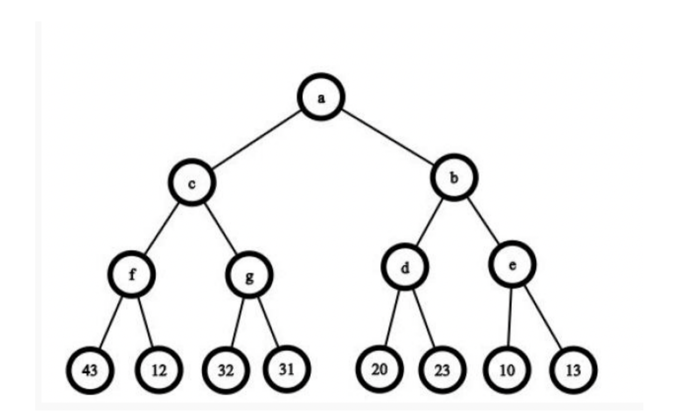
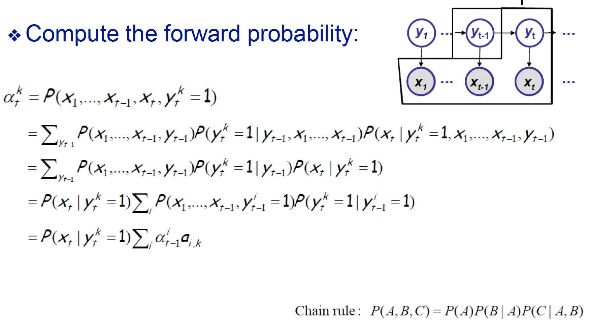
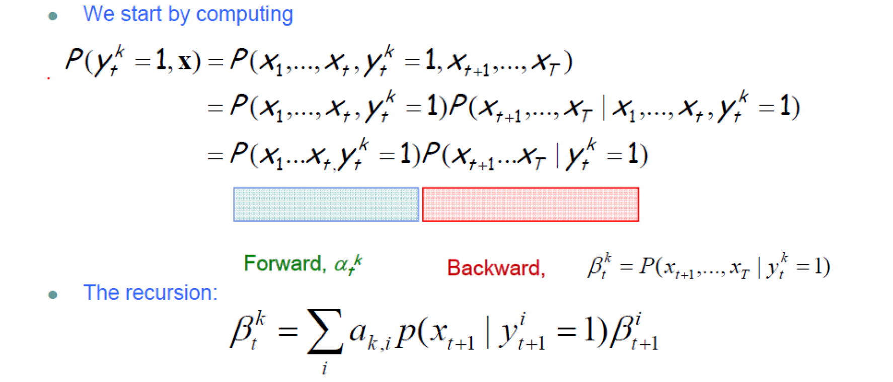

# AI-review

## CS410人工智能：A Review by [Yanjie Ze](http://yanjieze.com)

Start from Jan 2, 2022

注：十分感谢课程助教谢瑜璋提供大纲，以供同学们复习。本复习笔记基于大纲进行内容完善。

## 目录

\[TOC]

## 第一部分 人工智能概念

1.人工智能（AI，Artificial Intelligence）的定义

* 课件lecture1第5页：人工设计程序，让机器可以像人一样智慧地行动
* 更具体的定义在lecture1第7页，分为四个维度:
  * thinking humanly
  * Thinking rationally
  * Acting humanly
  * Acting rationally

2.图灵测试

目的：设计测试以验证计算机是否真的具有智能

3.代理人、理智（rational）行为、理智的代理人（agent）

见课件lecture1第11页

要了解代理人的定义、理智行为的定义、判断标准

* **Rational behavior**: doing the right thing
* **The right thing**: that which is expected to maximize goal achievement, given the available information
* Doesn't necessarily involve thinking – e.g., blinking reflex – but thinking should be in the service of rational action
* **Agent**: An agent is an entity that perceives and acts.

Agent的组成：课件lecture2a-1第10页，PEAS

* Performance measure
* Environment
* Actuators
* Sensors

4.环境

agent所处的各种类别的环境，对建模方式和算法的使用有很大的影响，各种环境的定义见lecture2第13页、14页

* Fully observable (vs. partially observable): An agent's sensors give it access to the complete state of the environment at each point in time.
* Deterministic (vs. stochastic): The next state of the environment is completely determined by the current state and the action executed by the agent. (If the environment is deterministic except for the actions of other agents, then the environment is strategic)
* Episodic (vs. sequential): The agent's experience is divided into atomic "episodes" (each episode consists of the agent perceiving and then performing a single action), and the choice of action in each episode depends only on the episode itself.

## 第二部分 解决问题的方法：搜索答案

### 1. 搜索问题的建模方式

需要明确搜索空间的状态、初始状态、转移模型、动作、目标、路径耗散，通过明确以上定义与状态空间的大小来建模搜索问题

可以参考第一次作业的第三题和课件lecture2b-1 12页

* 一个problem由4个部分构成：
  * Initial state
  * actions
  * goal test
  * path cost
* solution：A solution is a sequence of actions leading from the initial state to a goal state

***

例题1：假如我们现在有一个长度为 _M_ 个格子、宽度为 _N_ 个格子的棋盘，盘子中有一些障碍物、形成了一个迷宫。有两个机器人希望根据他们的位置让他们尽快相遇（相遇指的是让两个机器人处在同一个格子里即可，不需要让他们面对面朝向）。机器人在一个行动单位内可以沿着自己朝向的方向移动到一个相邻的格子内、或者旋转自己朝向的方向 90_◦_。

（1）请将该问题形式化，我们需要如何简单地定义该问题的状态（state)？

（2）对于该状态而言，你定义的状态其状态空间有多大（size）？

（3）继续形式化该问题，描述该问题的行动、目标测试、路径耗散（简单描述即可）。

（4）如果使用搜索算法解决该问题，请给出一个启发函数 _h_，该启发函数满足可接受性。

答：

(4)启发函数 _h_ 需要满足可接受性，指每个状态到最终目标花费的实际时间成本需要高于其启发式函数值。因此可以设计启发函数 _h_ 为两个机器人的曼哈顿距离或者欧氏距离，由于机器人一次只能移动到相邻格子、不能斜着移动，因此两个机器人之间的最短距离会大于等于其曼哈顿距离与欧氏距离。除此以外，还需要考虑机器人转向的时间成本，因此实际到达目标花费的时间成本会大于等于启发函数 _h_。

注：**启发函数**：

* 可接受性：admissible，即 $h(n)\leq h^_(n)$，$h^_(n)$为从n到达终点的实际cost
* 一致性：consistent，即$h(n)\leq c(n,a,n') + h(n')$，$n'$是$n$的后继节点。直观理解，三角形两边之和大于第三边，从n到达终点的cost肯定得 小于等于 $n'$到终点的cost再加上 $n$到$n'$的cost。

***

### 2. 比较搜索算法

可以从算法的完备性、最优性、时间复杂度、空间复杂度来比较，要理解以上定义。我们作业里也有相关的问题，第一次作业里有比较BFS、UCS、DFS的题目。

***

例题2：比较宽度优先算法（BFS）一致代价搜索（UCS）、深度优先算法（DFS）的优劣。

答：可以比较三种算法的完备性、最优性、复杂度等角度比较。BFS 算法时完备的、单位代价的情况下时最优的，但是需要保存所有产生的节点值、空间复杂度高；UCS 算法对于一般性的步骤代价而言是最优的；BFS 与 UCS 算法的时间空间复杂度均为 $O(b^d)$。DFS 算法不是完备的、也不能保证最优性，但是只需要存储一条从根节点到叶节点的路径、以及该路径上每个节点上所有未被扩展的兄弟节点即可，当一个节点被扩展，当它的所有节点都被探索过后该节点就从内存中删除、空间复杂度低，为 _O_(_bm_)，其中 _m_ 为最大深度。

***

评价一个搜索算法的标准：

* 完备性。如果有解，是否能找到？
* 时间复杂度、空间复杂度
* 最优性。是否能找到最优解？

BFS，UCS，DFS的比较：

* BFS, breadth first search。是最优的。但是需要保存所有节点，空间复杂度高。时间、空间复杂度$O(b^d)$。
* UCS, uniform cost search。扩展cost最小的节点。时间复杂度$O(b^d)$。
* DFS, depth first search。不完备（因为有可能遇到深度无限的情况）。不最优。但空间复杂度低，为$O(bd)$，其中d是最大深度。时间复杂度也是$O(b^d)$。

### 3. 无信息搜索

包含：DFS、BFS、UCS、深度限制搜索、深度迭代搜索等，这一部分肯定是很重要的，可以出小题也可以出大题

从lecture2b-1第20页开始，要理解以上算法的过程，然后从完备性、最优性、时间复杂度、空间复杂度等角度比较优劣。如果有不理解的地方，可以参考canvas上的教材，上面对每个算法都描述得很详细。

* BFS, breadth first search。是最优的。但是需要保存所有节点，空间复杂度高。时间、空间复杂度$O(b^d)$。
  * 优点：可以找到最短路径
  * 缺点：要存储很多节点
* UCS, uniform cost search。扩展cost最小的节点。时间复杂度$O(b^d)$。
* DFS, depth first search。不完备（因为有可能遇到深度无限的情况）。不最优。但空间复杂度低，为$O(bd)$，其中d是最大深度。时间复杂度也是$O(b^d)$。
  * 完备性：当space是无限的时候不完备，有限的时候完备。
* Depth limited search。加上了深度限制的DFS。
* Iterative deepening search。对深度限制$l$进行depth limited search的迭代。
  * 先用depth=1的DFS，再depth=2的DFS，.....
  * 优点：linear memory, $O(bm)$。并且可以保证找到minimal depth的节点。

### 4. 有信息搜索

（1）算法包含：贪婪搜索、A\*搜索等

从lecture 2b-1第52页开始，要理解以上算法的过程

**A\*算法最优性的证明不要求记忆**

（2）要理解有信息与无信息搜索的区别在哪里，可以参考第二次作业的第一题

（3）启发函数：理解启发函数的定义、作用，理解启发函数的可接受性（admissible）和一致性（consistency），理解启发函数的比较（哪个启发函数更“好”）

Lecture2b-1第52-62页

***

**例题3**：（重要）

证明以下结论（仅需要简单说明证明思路即可，不用写太多）:

（1）BFS 搜索算法是 UCS 搜索算法的特殊情况。

（2）UCS 搜索算法是 A\*算法的特殊情况。

（3）运行 A\*算法时，若启发式函数 _h_ 满足一致性，那么在启发式搜索算法的搜索树中每条路径的子节点的 _f_ 值大于等于其父节点。

（4）若启发式函数 _h_ 满足一致性，那么它也会满足可接受性。

答：

（4）

我们可以选取任意一个节点 _G_，那么其他节点都会有一条到 _G_ 的最短路径。如果我们选取任意一条最短路径上距离 _G_ 一个步骤的某个节点 _n_1，那么我们根据启发式函数的一致性，会有 _h_(_n_1) _<_= _h_(_G_) + _c_(_n_1\*, G, a\*)。如果我们用 _h\*\*∗_ 来表示某点到终点的实际最小代价，那么就会有h(n1) <= h\*(n1), 即 _n_1 可以满足启发函数的可接受性。之后我们再将 _n_1 不断扩展，对于距离

_G_ 最短距离有两个步骤的节点 _n_2，我们用类似的方法可以得到 _h_(_n_2) _<_= _h_(_n_1) + _c_(_n_2\*, n_1_, a\*) _<_= _h\*\*∗_(_n_1) + _c_(_n_2\*, n_1_, a\*) = _h\*\*∗_(_n_2)。注意：_h_ 是我们估计当前节点到终点的代价，所以一般默认终点的 _h_(_G_) = 0。有同学提出如果 h 为一个常数的话，比如 h=1000，有可能会满足一致性而不满足可接受性。不过一般我们默认终点的 _h_(_G_) = 0，所以该命题仍然是成立的。

***

#### 4.1 算法

* Best-fit search: 使用一个evaluation function $f(n)$给每个node。按$f(n)$降序排列，先遍历$f(n)$比较高的。
  * 特殊情况: greedy best-frist search，A\* search
* Greedy best-first search：$f(n)=h(n)$，h是启发函数，是从n到达终点的cost的估计。
  * 完全性：no。可能会stuck在loop里
  * 时间：$O(b^m)$，但是好的启发函数能有较好的提升。
  * 空间：$O(b^m)$，需要记住所有的node。
  * 最优性：no。
* A\* search: $f(n)=g(n)+h(n)$
  * $g(n)$: cost so far to reach n
  * $h(n)$: estimated cost from n to goal (启发函数)
  * $f(n)$: estimated total cost of path through $n$ to goal
  * **启发函数**：
    * 可接受性：admissible，即 $h(n)\leq h^_(n)$，$h^_(n)$为从n到达终点的实际cost
    * 一致性：consistent，即$h(n)\leq c(n,a,n') + h(n')$，$n'$是$n$的后继节点。直观理解，三角形两边之和大于第三边，从n到达终点的cost肯定得 小于等于 $n'$到终点的cost再加上 $n$到$n'$的cost。
    * **定理**：如果$h(n)$是admissible的，A\*就是optimal的。
  * 完全性：yes
  * 时间：exponential
  * 空间：all nodes
  * 最优性：yes

#### 4.2 有信息搜索和无信息搜索的区别

无信息搜索是指我们不知道接下来要搜索的状态哪一个更加接近目标的搜索策略，因此也常被成为盲目搜索。有信息搜索需要访问启发式函数 _h_(_n_) 来估算从当前节点到目标的解代价，从而衡量哪一个状态更加接近目标状态，并优先对该状态进行搜索，因此与无信息搜索相比往往能够更加高效得解决问题。

#### 4.3 **启发函数的比较**

*   Dominace: 如果$h\_2(n)\geq h\_1(n)$（且他们都是admissibale的）对于所有n，则$h\_2$ dominates $h\_1$

    $\Rightarrow$ 说明$h\_2$比$h\_1$好

### 5. 局部搜索

#### 5.1 理解局部搜索与系统搜索（包括有信息与无信息搜索）的区别在哪里，参考第二次作业第一题

***

解答：

（1）扩展新节点：在扩展节点时，系统搜索算法需要考虑当前节点在整个搜索空间中产生的所有可能的新状态，并将所有可能的新状态加入查询队列。但是局部搜索算法通常从当前状态出发，移动到附近的某个节点，并将改变后的新状态加入队列。

（2）路径：系统搜索算法一般需要储存从根节点到叶子结点的每一条路径，每一条路径可以视为问题的一个可能解。而局部搜索算法一般不存储路径，只关注叶子结点最终的状态。

（3）复杂性：系统搜索算法一般时间复杂性和空间复杂度都较高。对于相同规模的问题，局部搜索算法需要扩展的节点较少、且一般不需要储存路径，故一般时间复杂性和空间复杂性都要低一些。

（4）适用范围：系统搜索算法可以用于探索问题的所有解或者证明命题是否成立，而局部搜索算法一般用于最优化问题。

***

#### 5.2 算法包括：爬山法、模拟退火算法、局部束搜索、遗传算法，从lecture3-1第5页开始到第40页

#### 5.3 爬山法：理解爬山法过程、爬山法可能会遇到怎样的问题

* 过程：更新为neighbour中value最大的那个，直到找到一个局部最优
* 问题：局部最优不一定是全局最优
* 改良：
  * random restart
  * simulated annealing

#### 5.4 模拟退火算法：是对爬山法的改良，“退火”的目的是什么，过程中选择“坏”移动的概率与哪些因素有关

*   当next state比current state差的时候，只以$e^{\Delta E/T}$的概率转移到next state

    （感觉这玩意和epsilon-greedy其实差不多）
* 选择坏移动的概率与\_\_\_有关：
  * 时间
  * 相对于当前的状态坏多少

#### 5.5 局部束搜索（local beam search)：关注k个状态，而不是一个状态

* 开始的时候选k个状态，同时搜索。（和并行差不多的感觉）

#### 5.6 遗传算法：遗传算法中的定义（lecture3-1第29页）、有哪些步骤（第32页）、每个步骤的目的是什么

* 一些定义：
  * Individual
  * Population：由individual组成
  * Fitness：进行优化的target function，每个individual都有
  * Trait：possible aspect of an indiviual
  * Genome: Collection of all chromosomes (traits) for an individual
* 步骤：
  1. 初始生成population
  2. evaluate fintness
  3. 判断终止条件，没有的话选择parents
  4. 进行crossover, mutation
  5. 生成新的后代
  6. 回到第2步

### 6. 对抗搜索

#### 6.1 解决对抗搜索的算法

MiniMax算法，理解算法的流程，课件lecture4第14页到23页，可以结合Tic-Tac-Toe这个例子和第二次作业的第三题来看，看懂了过程就行。

**其实就是递归。**

* 完全性：yes
* 最优性：yes
* 时间复杂度：$O(b^m)$，b是legal moves的个数，m是最大深度
* 空间复杂度：$O(bm)$。因为是DFS。

#### 6.2 Alpha-beta剪枝

在算法过程中，alpha代表什么，beta代表什么（课件lecture4第38页）。在算法运行过程中，何时需要比较节点与alpha、beta值的大小关系？何时需要剪枝？除此以外，Alpha-beta剪枝还具有一些性质（课件lecture第45页）。

***

例题4:

我们的 minimax 搜索树如图1所示。

（1）假如我们的 **a** 节点是 **max** 节点，请问最后 **a** 节点会得到怎样的值？

答：a=32。

（2）假如我们使用 _α β_ 剪枝法进行 minimax 树的搜索，搜索过程中会从左至右访问相关节点，且 **a** 节点是 **max** 节点。算法运行过程中会访问多少个节点（包括字母标号的节点与数字标号的叶节点、忽略重复访问）？同时，请写下各节点的访问顺序（例如顺序：**”a - c - f - 43”**） 。

使用α−β 剪枝法进行minmax 树的搜索，过程中我们需要维护α（当前搜索路径上目前max 得到的最好结果）与β（当前搜索路径上min 的最好结果），并且在适当的时候剪枝。在运行到min 节点n 时，会检查当前节点下子树返回的值与当前节点的α 值，如果子树返回的值小于α 值，说明该min 节点遍历所有子树后得到的值一定小于α 值，可以断定在第n-1 步max做决定的时候不会让min 有这种机会。因为在n-1 步，上层的max 就知道存在着一个策略D，使得value 值为.，max 可以忽略n 所在的子树。同理，在max 节点，我们会检查子树返回的值与当前节点的β 值，如果大于β 即剪去该节点与其子树。

在搜索过程中，刚开始的过程与常规的minmax 树相同，我们用类似于DFS 的算法对搜索树进行访问。我们会依次访问a - c - f - 43 - 12 - g - 32 - 31。此时我们可知e 节点的值为32，由此在a 节点处，其维护的α 值为32。之后我们会再访问b、d、20、23 节点，此时我们可以推定d 节点的值为23。那么当我们重新返回b 节点时，可知b 节点的取值必须小于等于23，也就是小于该节点得到的α 值。那么此时b 节点所在的整个分枝会被剪掉，算法直接返回b 的上一层，也就是a 节点。

算法总共会访问12 个节点，顺序为a - c - f - 43 - 12 - g - 32 - 31 - b - d - 20 - 23。

***

### 7. CSP问题

#### 7.1 回溯算法：课件lecture5第18页，回溯的目的、算法流程，看懂了过程就行

Backtracking search = DFS + two improvements

* Idea 1: One variable at a time
* Idea 2: Check constraints as you go

#### 7.2 给元素安排值的顺序：most constrained variable，minimum remaining values（第29页）

* Most constrained variable: choose the variable with the fewest legal values
  * a.k.a. minimum remaining values (MRV)heuristic
* Least constraining value: The one that rules out the fewest values in the remaining variables。使得其他的变量的可选value减少最少的value。（这个应该需要在更新的时候算一下其他变量的变化）

#### 7.3 前向检查：前向检查的目的（第32页），前向检查的内容（弧相容性），前向检查的算法（AC3算法，44页开始）。关于AC3算法，可以参考第二次作业的第四题，重点是理解过程。

* forward checking的idea
  * Keep track of remaining legal values for unassigned variables
  * Terminate search when any variable has no legal values
  * 但是，forward checking不能很早地detect failure
* Arc consistency:
  * X $\rightarrow$ Y is consistent iff for every value _x_ of _X_ there is some allowed _y_
  * Arc consistency detects failure earlier than forward checking
* AC3: Enforce Arc Consistency of Entire CSP
  1. 先给第一个着色
  2. 然后把所有指向这个点的其他邻居的arc加入队列。
  3. 出队，更新他们的feasible variable
  4. 每当有一个点的feasible variable改变，都要把所有指向这个点的邻居的arc加入队列。
* arc consistency的局限性：这是一个local的操作，可能会全局上并没有解！看61页的图。

#### 7.4 弧相容性：定义（第37页）

* X $\rightarrow$ Y is consistent iff for every value _x_ of _X_ there is some allowed _y_

## 第三部分 知识表示、自动推理

### 8. 一阶逻辑（first-order logic）

也叫propositional logic，命题逻辑

#### 8.1 定义，在课件lecture7a第3页

* Declarative
* compositional
* context-independent
* Limited expressive power。不能表示比较复杂的逻辑关系。

#### 8.2 逻辑符号，在课件lecture7a第7页，要能看懂

* constant
* Predicate
* function
* variable
* connective
* equality
* quantifier

### 9. 知识表示

#### 9.1 定义：课件8b第7页

* 把知识转化为计算机可接受的符号，并以某种形式描述出来。如图表结构、语法树、规则匹配模式、树形或网状表达等
* 知识表示就是知识的符号化过程。即把相关问题的知识加以形式化描述，表示成为便于机器（计算机）存储、管理和调用的某种数据结构模式

#### 9.2 常见的知识表示系统：语义网络（课件23-24页）、专家系统（43页）、知识图谱（第65页），对以上概念做了解即可

* 语义网络：语义网络结构共使用了三种图形符号：框、带箭头及文字标识的线条和文字标识线。分别称为:
  * 节点
  * 弧
  * 指针
* 专家系统：两部分组成，知识库与推理引擎。它根据一个或者多个专家提供的知识和经验，通过模拟专家的思维过程，进行主动推理和判断，解决问题。
* 知识图谱：知识图谱（Knowledge Graph）以结构化的形式描述客观世界中概念、实体及其之间的关系，将互联网的信息表达成更接近人类认知世界的形式，提供了一种更好地组织、管理和理解互联网海量信息的能力。

### 10. 不确定性知识与推理：贝叶斯网络

#### 10.1 概率基础知识：在课件9a-1上，包括概率定义、贝叶斯公式、联合概率定义、条件独立定义

#### 10.2 贝叶斯网络中的联合概率因子分解：课件9b-1第11-14页

* 把一个联合概率用条件概率和chain rule分解一下就行。

#### 10.3 马尔可夫毯定义、包含哪些节点：第16页

* 包含父节点，子节点，子节点的co-parent
* The Markov blanket of a node being the minimal set of nodes that isolates it from the rest of the graph.

#### 10.4 贝叶斯网络中的条件独立判断：第20页。课件中和作业中涉及的例子都比较简单，如果想得到普适性的方法、研究较复杂网络结构中的条件独立关系可以参考该材料：http://web.mit.edu/jmn/www/6.034/d-separation.pdf

* 父节点固定，使得2个子节点互相独立
* A->B->C，B节点固定，使得AC独立
* A,B是C的父节点，固定C，使得A、B相关

#### 10.5 贝叶斯网络的推理：精确推理（消元法、信念传播、树算法），近似推理（贝叶斯网络采样）。课堂与作业主要涉及消元法与贝叶斯网络采样两部分。

#### 10.6 消元法：课件36-47页，第三次作业第三题最后一问，重点是理解清楚过程。

第三次作业第三题的分析：

（1）用链式法则乘起来就行

（2）把一个变量的Markov毯中的变量固定

（3）主要掌握三种结构，cascade, common parent, V-structure，已经在10.4部分阐述

（4）消元法，就是把要消的变量改写，换成一个函数。

#### 10.7 贝叶斯采样：课件lecture10的62页开始，包含先验采样、拒绝采样、似然采样、吉布斯采样四种。四种采样方式都要理解清楚完整的过程与概率计算。具体如何计算应当按照课件上标注的算法来。

一些重点：拒绝采样（何时拒绝、拒绝以后的操作）、似然采样（证据变量如何处理、likelihood如何计算）、吉布斯采样（何时采样、证据变量如何处理、采样哪些节点、条件概率如何计算）。建议把第三次作业第四题的解答看明白，肯定就理解清楚完整的采样过程了。

1. 先验采样：sample $x\_i$ from $P(X\_i|Parents(X\_i))$
2. 拒绝采样：sample $x\_i$ from $P(X\_i|Parents(X\_i))$，并且如果不满足evidence则直接返回，重新采样（相当于做了个剪枝？）
3. 似然采样：拒绝采样并没有用到evidence这个先验，因此我们考虑似然采样。
   * 初始w=1
   * 如果x是evidence，$w=w\times P(x|parent(x))$
   * 如果x不是evidence，sample $x\_i$ from $P(X\_i|Parents(X\_i))$
   * 最后返回sample和weight，这个weight就是每个sample的weight
4. 吉布斯采样：
   * 维持一个状态，其中evidence是fixed
   * 每次采样需要考虑马尔科夫毯之类的节点，用条件概率算（看上去复杂一点，但也不难）
   * 每尝试一个状态就是一次采样

### 11. 不确定性知识与推理：HMM（时间上的概率推理）

这一块课件上的内容和算法都比较难，公式也很多，我们不会考察具体的算法中如何进行计算。能把涉及到的概念和作业题目理解即可。

#### 11.1 HMM中的建模方式、基本概念：课件11第6页

* 一些定义
  * observation space
  * transition probability $p(y\_t|y\_{t-1})$
  * start probability $p(y\_1)$
  * Emission probability $p(x\_t|y\_t)$
* 三个问题：
  * evaluation：给定HMM和sequence x，算sequence x的概率。用forward算法。
  * decoding：给定HMM和sequence x，算能够最大化sequence x的y的概率。用Viterbi，forward-backwarf算法。
  *

#### 11.2 评价HMM中某个序列出现的概率：前向、后向算法

*   forward：先用条件概率展开（主要通过图来看这些变量的关系），然后化简一下并用之前的定义的变量替代就行（emission probability, transition probability）

    
*   backward: 给出一整个sequence x，计算$y\_t=1$的概率。先分成两段，forward和backward。forward用之前的公式代替一些，backward用一个变量代替一下。

    

TODO: homework3第五题看完整。

#### 11.3 根据给定的明状态解码相应的隐状态：维特比算法，lecture 11 P37

TODO：看完维特比算法

## 第四部分 机器学习

### 12. 机器学习基础概念（课件12-1，这一块主要是要理解的概念）

1. 机器学习定义：第5页到第10页，理解即可、不要求完整记忆
   * “A computer program is said to learn from experience E with respect to some task T and some performance measure P, if its performance on T, as measured by P, improves with experience E.”
2. 机器学习分类：第21页，无监督学习、有监督学习、强化学习，他们给自的定义是什么、他们之间如何区分，我们课堂内讲的机器学习算法可以归入他们哪一类
3. 训练集、测试集：第24页，各自的定义、用来完成什么样的任务
4. 浅层学习（传统机器学习）与深度学习：第44-50页，深度学习的显著特征是什么
   * 浅层学习：linear regression, support vector machine, artificial neural network (with one hidden layer)
   * 深度学习：ANNs with more than one hidden layers,convolutional NNs, recurrent NNs, deep belief net, auto-encoders
   * 深度学习： automatic feature extraction
5. Bias-variance平衡：第59页，bias、variance代表什么，他们与什么因素有关
   * 
   * bias: The bias is an error from erroneous assumptions in the learning algorithm. High bias can cause an algorithm to miss the relevant relations between features and target outputs (underfitting).
   * variance: The variance is an error from sensitivity to small fluctuations in the training set. High variance can cause an algorithm to model the random noise in the training data, rather than the intended outputs (overfitting).
   * The 3rd term is called the irreducible error, resulting from noise in the problem itself.
6. 模型泛化能力：第60页，通过结构风险最小化（SRM，Structural Risk Minimization）控制泛化能力
7. 正则化：64页与73页，L1与L2正则化是什么，他们适合用来完成什么样的任务
   * Using the L2 norm pulls directly towards the origin.
   * While using the L1 norm pulls towards the coordinate axes, i.e. it tries to set some of the coordinates to 0.
   * This second approach can be useful in a feature-selection setting.
   * L1正则化就是在loss function后边所加正则项为L1范数，加上L1范数容易得到稀疏解（0比较多）。L2正则化就是loss function后边所加正则项为L2范数的平方，加上L2正则相比于L1正则来说，得到的解比较平滑（不是稀疏），但是同样能够保证解中接近于0（但不是等于0，所以相对平滑）的维度比较多，降低模型的复杂度。
8. 交叉验证：留出法、留一法、k折交叉验证的区别（69-71页）
   * 留出法 (held-out data)
     * 从训练数据里拿10%-20%作为held-out data
     * 这一部分不是用来最终测试的，是模型在训练后，在held-out data做一下测试，选test error最小的模型
   * K-fold Cross Validation
     * 把训练数据分为k份，每次随机选一份用来测试，其他k-1份用来训练
     * 重复k次，最后选择具有average test error最小的。
   * Leave-One-Out (LOO) Cross-Validation
     * k-fold cross validation的特殊情况，每次只挑出一个作为test，所以一共重复n次。
     * 当n比较小的时候使用
9. 特征选择：原因（78页）
   * Some algorithms scale (computationally) poorly with increased dimension，维度更高计算更慢
   * Irrelevant features can confuse some algorithms，无关特征迷惑算法
   * Redundant features adversely affect regularization，冗余特征影响泛化性
   * Removal of features can increase (relative) margin (and generalization)，移除可提高泛化性
   * Reduces data set and resulting model size，缩小数据集规模和模型规模
10. 过拟合、欠拟合的定义，如何解决过拟合与欠拟合问题（参考第四次作业第一大题的解答）

    机器学习模型的过拟合：我们通过机器学习建立的模型对于训练数据拟合过当，导致其在训练集上的表现很好、但是在测试集与新数据上的表现较差。

    一般而言，导致机器学习模型过拟合的原因有：

    (a) 训练数据噪声过大、导致模型学习了太多与任务无关的信息；

    (b) 输入的数据样本不平衡，例如训练样本中绝大部份样本为标签为‘0’的负样本，导致模型学习到太多与单一类别相关的特征。

    (c) 设计的模型相对于数据量而言过于复杂、同样导致模型学习了太多无关信息；

    针对以上的原因，我们可以提出以下措施来避免过拟合：

    (a) 针对数据：获得更多的训练数据，从而减小噪声的影响，例如对于图像分类的问题，可以将某一张图像进行平移、旋转等方式扩充数据集，也可以通过GAN 来合成大量新数据（见课件lecture 14 第119 页）。

    (b) 针对数据：提供数据的质量，例如检查数据的正确性、标签的正确性、尽量保证标签类别的平衡。

    (c) 针对数据：对原始数据的特征进行特征选择（feature selection，见课件lecture 12 第77页），通过各种方法删除原始数据中的冗余特征。

    (d) 针对模型结构：可以尝试限制模型的复杂度，例如减少神经网络模型的网络层数、神经元个数等，降低决策树模型中的树的深度等。

    (e) 针对模型参数：对模型加入加入正则化方法（regularization，见课件lecture 12 第73 页)：给模型的参数加入一定的正则化约束或者增大正则化的系数，通过正则化限制模型的复杂程度。

    (f) 针对训练：在训练过程中进行交叉验证（cross validation，见课件lecture12 第68 页)，通过验证来检测过拟合现象、选择模型与参数。在训练过程中加入early stopping 机制（见课件13第33 页），限制神经网络训练的epoch 数目。

    机器学习模型的欠拟合：我们通过机器学习建立的模型在训练集上未学习到足够的特征与规律，从而使得模型在训练集与测试集上表现都很差。欠拟合现象的一般原因与过拟合现象相反，因此，我们可以通过以下方法来避免欠拟合的现象：

    (a) 针对数据：当特征不足或者现有特征与样本标签的相关性不强时，模型容易出现欠拟合，因此可以通过特征组合等方式，形成新的特征。

    (b) 针对模型结构：简单模型的学习能力较差，可以通过增加模型的复杂度来使得模型有更强的拟合能力。

    (c) 针对模型参数：正则化是用来防止过拟合的，但当模型出现欠拟合现象时，则需要有针对性地减小正则化系数。

### 13. 神经网络（课件13-1）

TODO：继续把剩下的看完

（1）感知机的结构、神经网络的结构与神经网络中参数更新的方式：课件8-15页，结合第四次作业第二题，最好把完整的参数更新过程自己推一遍、加深理解

（2）CNN：在图像（CV）领域应用非常成功

（3）RNN：适合处理时序性数据，原始RNN可能会遇到梯度衰减或者梯度爆炸任务，LSTM解决了这个问题

CNN与RNN这一块只需要简单了解即可、不要求推导。CNN与RNN这一块五花八门的模型（比如ResNet、VGG）啥的也不需要记忆。

### 14. 无监督学习（课件14）

（1）无监督学习任务举例：聚类、降维、自监督学习

（2）层次化聚类、Kmeans聚类、DBSCAN聚类的比较（参考作业）

（3）PCA降维的目的、主元的选择标准

### 15. 强化学习（课件15）

（1）强化学习完成了定义、完成了什么任务

（2）马尔可夫过程（MDP）的定义（第12页），value/utility的定义，policy的定义

（3）马尔可夫决策过程：理解value iteration和policy iteration的计算过程，这一块很难，但是我们没有出相关的作业，可以在网上找个例子结合起来看。

Value iteration的计算：先初始化每个点的value。在每一轮迭代中，根据24页的公式计算每个点新的value。迭代结束后用22页上部分的公式计算每个点应当采用的最优策略

Policy iteration的计算：先初始化每个点的value。每一轮迭代中，根据28页上方的公式计算每个点的utility(value），这一步也被称为policy evaluation。然后根据课件27页的公式计算每个点在该轮迭代中应该采样的policy，这一步也被称为policy improvement。在结束迭代以后得到每个点的policy选择。

（4）用神经网络进行强化学习：了解即可
